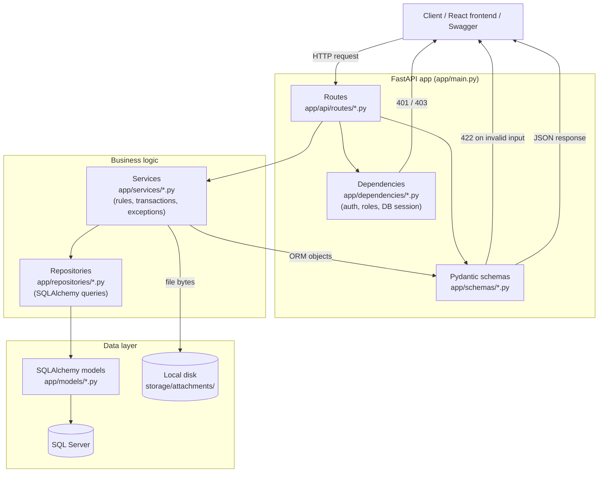
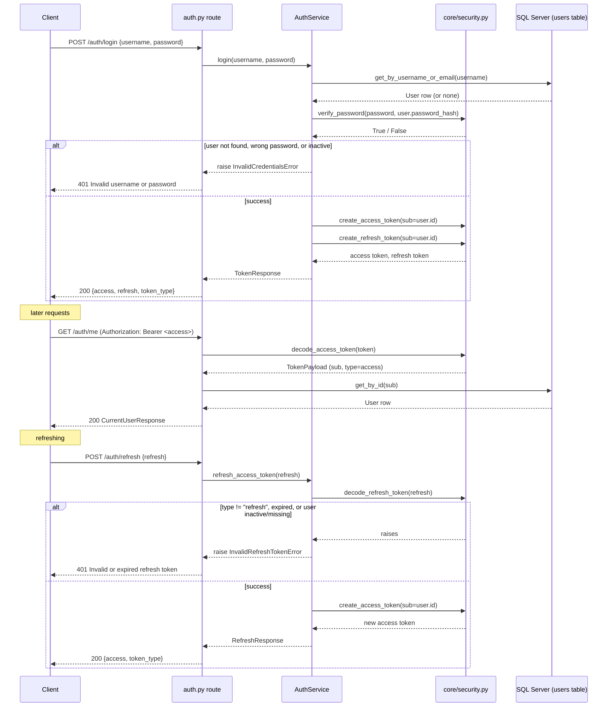
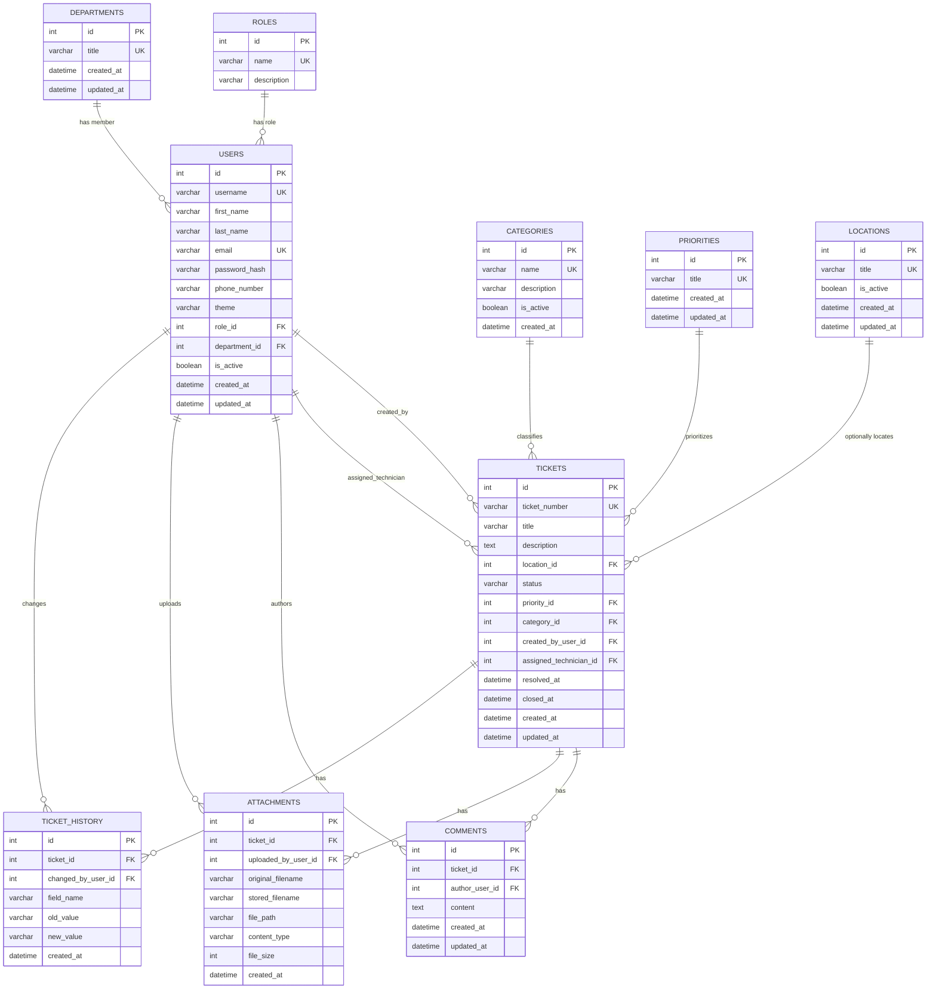
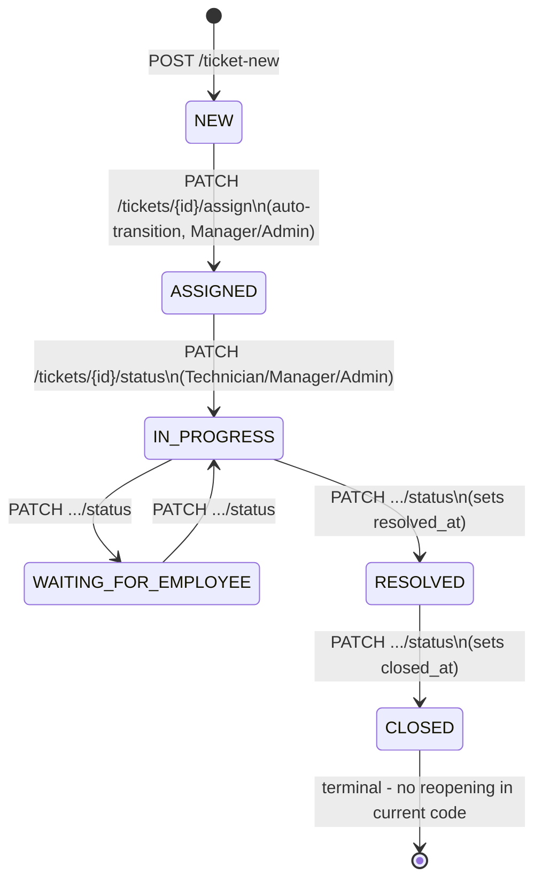
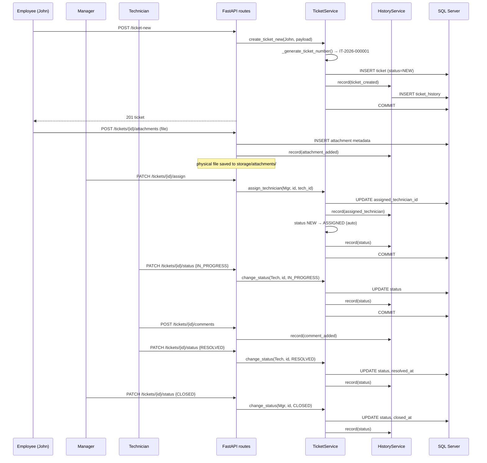
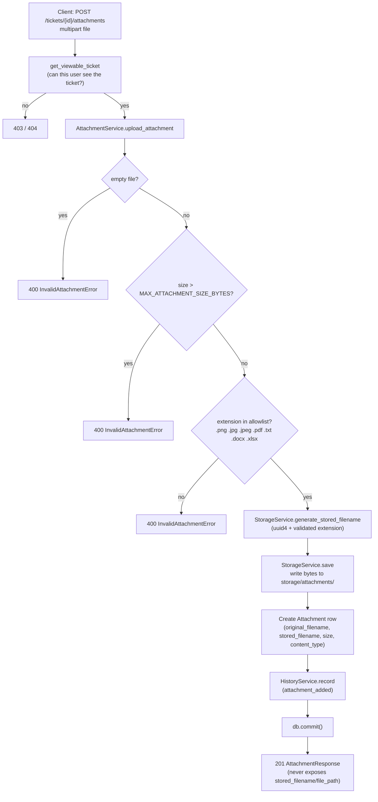
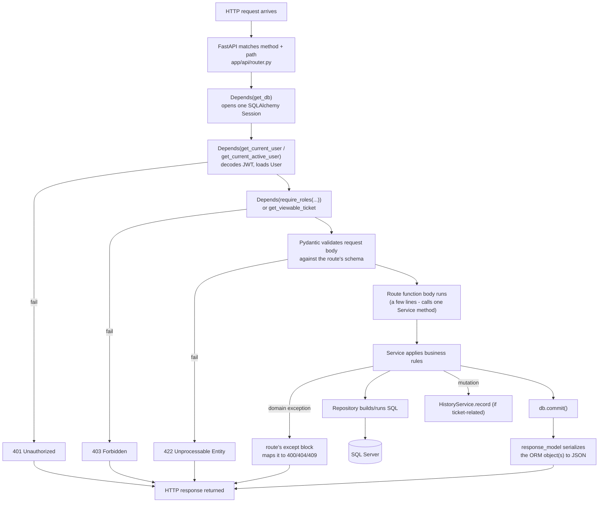

# ITOnIT Backend — Diagrams

All diagrams are Mermaid, generated from the actual code (models, routes, services) — not
guessed. See `docs/BACKEND_ARCHITECTURE.md` for the file/function references behind each one.

## 1. Overall architecture

## 2. Authentication flow

## 3. Database relationships (ERD)

## 4. Ticket lifecycle (status state machine)

## 5. Ticket lifecycle (full sequence, one worked example)

## 6. Attachment upload flow

## 7. Request-processing flow (generic, applies to every endpoint)

