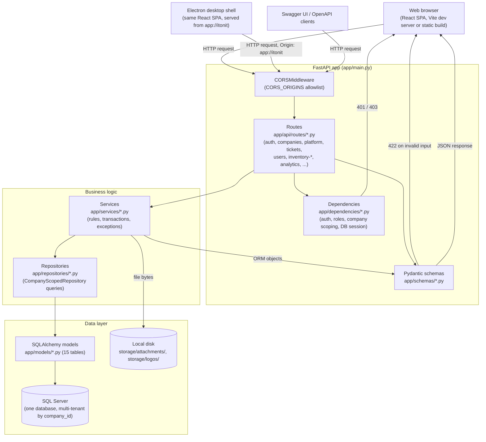
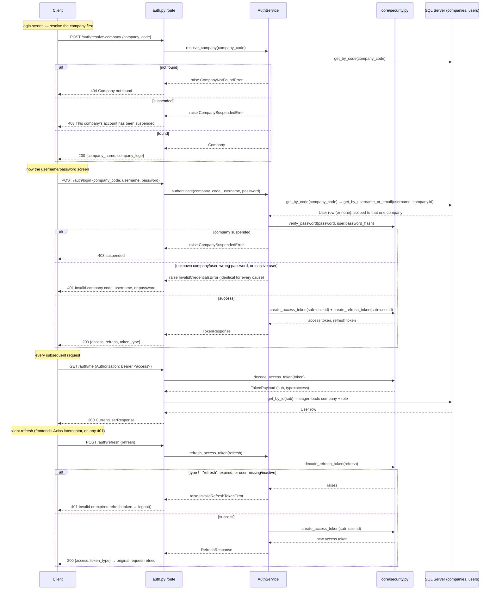
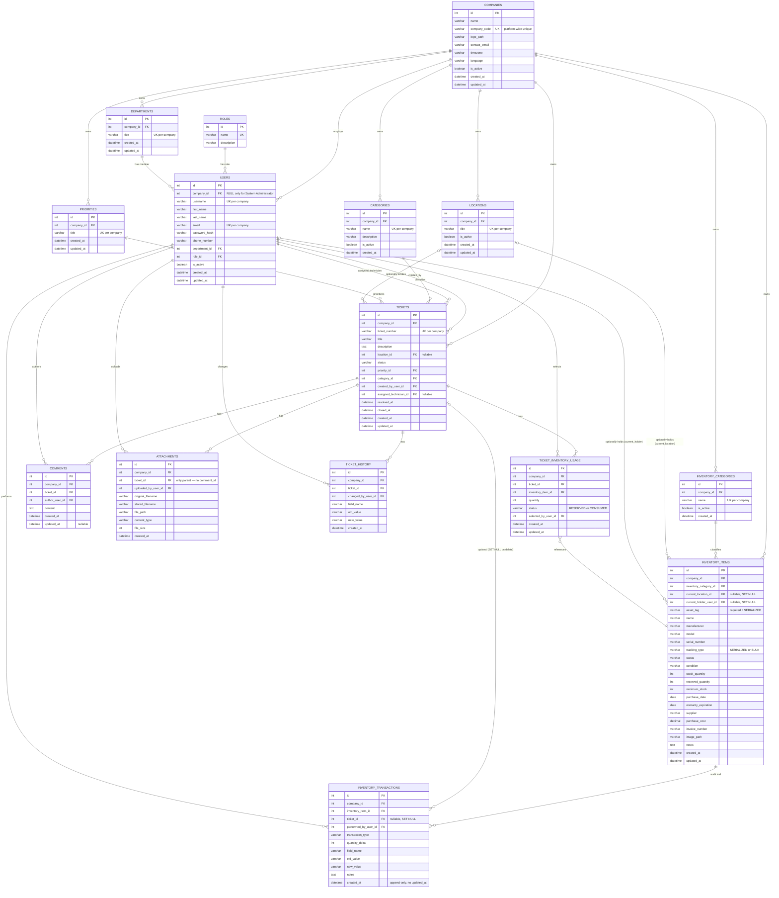
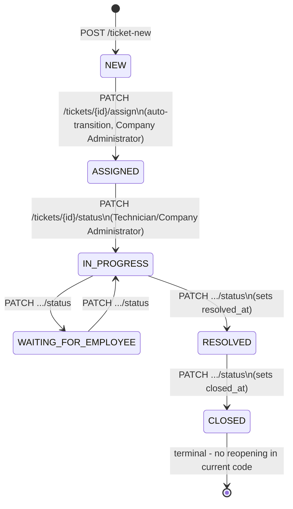
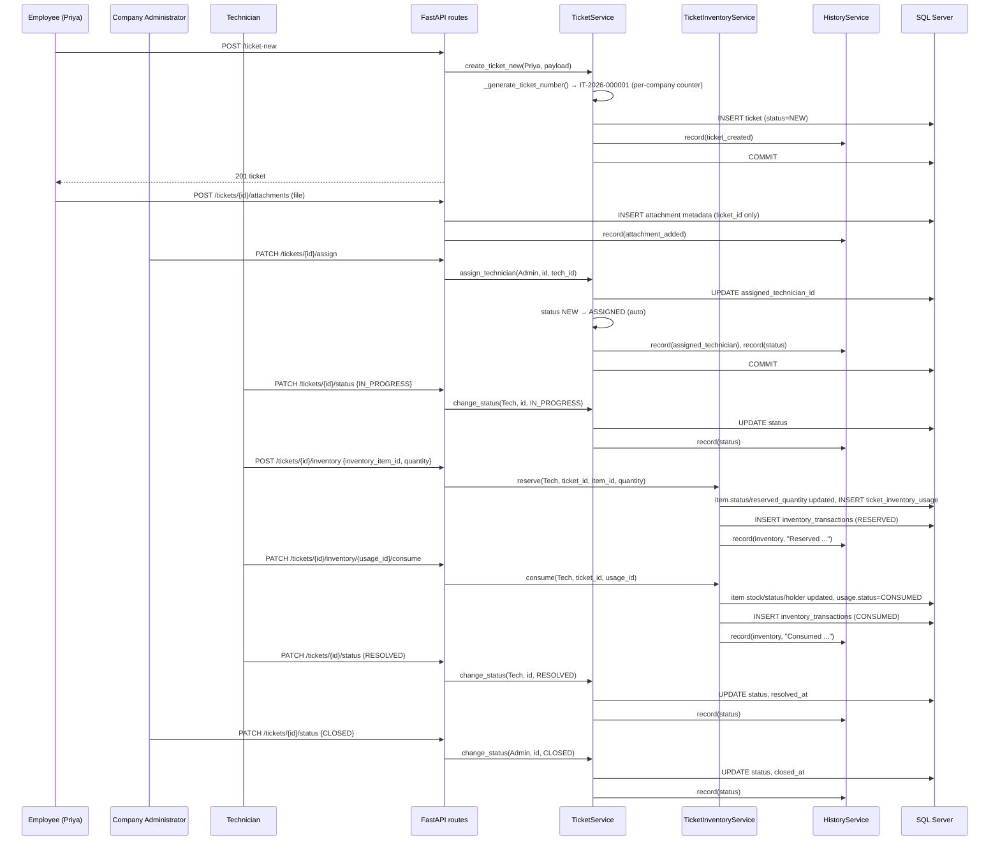
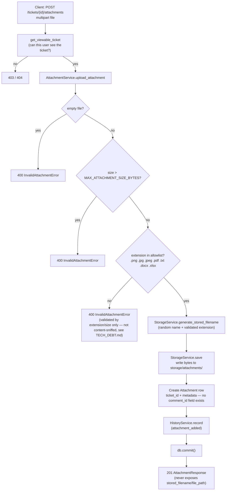
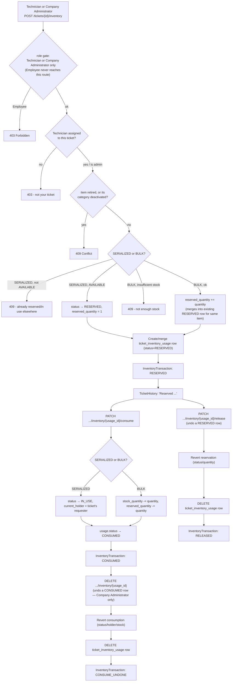
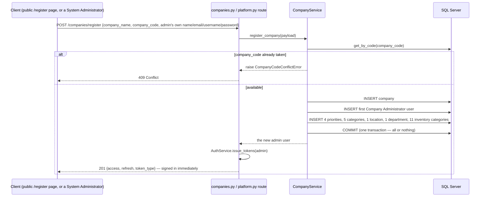
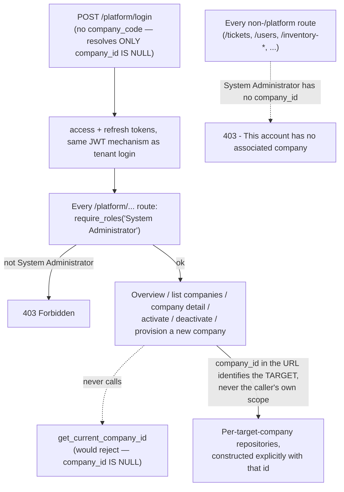
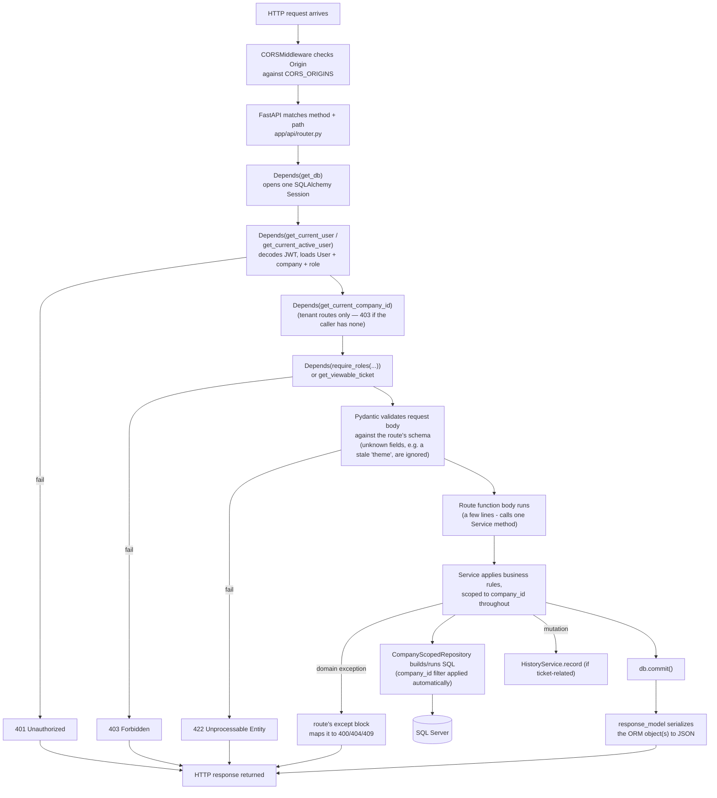

# ITOnIT Backend — Diagrams

All diagrams are Mermaid, generated from the actual final code (models, routes,
services) — not guessed, and not the pre-multi-tenant design this file used to
describe. See `docs/BACKEND_ARCHITECTURE.md` for the file/function references
behind each one.

## 1. Overall architecture

```mermaid
flowchart TD
    WebClient["Web browser\n(React SPA, Vite dev server or static build)"]
    DesktopClient["Electron desktop shell\n(same React SPA, served from app://itonit)"]
    Swagger["Swagger UI / OpenAPI clients"]

    subgraph FastAPI["FastAPI app (app/main.py)"]
        CORS["CORSMiddleware\n(CORS_ORIGINS allowlist)"]
        Routes["Routes\napp/api/routes/*.py\n(auth, companies, platform, tickets,\nusers, inventory-*, analytics, ...)"]
        Deps["Dependencies\napp/dependencies/*.py\n(auth, roles, company scoping, DB session)"]
        Schemas["Pydantic schemas\napp/schemas/*.py"]
    end

    subgraph Domain["Business logic"]
        Services["Services\napp/services/*.py\n(rules, transactions, exceptions)"]
        Repos["Repositories\napp/repositories/*.py\n(CompanyScopedRepository queries)"]
    end

    subgraph Data["Data layer"]
        Models["SQLAlchemy models\napp/models/*.py (15 tables)"]
        DB[("SQL Server\n(one database, multi-tenant by company_id)")]
        Disk[("Local disk\nstorage/attachments/, storage/logos/")]
    end

    WebClient -->|HTTP request| CORS
    DesktopClient -->|HTTP request, Origin: app://itonit| CORS
    Swagger -->|HTTP request| CORS
    CORS --> Routes
    Routes --> Deps
    Deps -->|401 / 403| WebClient
    Routes --> Schemas
    Schemas -->|422 on invalid input| WebClient
    Routes --> Services
    Services --> Repos
    Repos --> Models
    Models --> DB
    Services -->|file bytes| Disk
    Services -->|ORM objects| Schemas
    Schemas -->|JSON response| WebClient
```

The desktop app is a thin Electron shell around the exact same React bundle —
it is not a second frontend and it does not bundle FastAPI or SQL Server (see
`docs/BACKEND_ARCHITECTURE.md` §23 and the root `README.md`'s Electron
section). Both clients hit the same external API over HTTP; the only
difference is the origin the request comes from, which is why that origin
must be present in the backend's `CORS_ORIGINS` allowlist.

## 2. Authentication flow (tenant login)

```mermaid
sequenceDiagram
    participant C as Client
    participant R as auth.py route
    participant A as AuthService
    participant S as core/security.py
    participant DB as SQL Server (companies, users)

    Note over C: login screen — resolve the company first
    C->>R: POST /auth/resolve-company {company_code}
    R->>A: resolve_company(company_code)
    A->>DB: get_by_code(company_code)
    alt not found
        A-->>R: raise CompanyNotFoundError
        R-->>C: 404 Company not found
    else suspended
        A-->>R: raise CompanySuspendedError
        R-->>C: 403 This company's account has been suspended
    else found
        A-->>R: Company
        R-->>C: 200 {company_name, company_logo}
    end

    Note over C: now the username/password screen
    C->>R: POST /auth/login {company_code, username, password}
    R->>A: authenticate(company_code, username, password)
    A->>DB: get_by_code(company_code) → get_by_username_or_email(username, company.id)
    DB-->>A: User row (or none), scoped to that one company
    A->>S: verify_password(password, user.password_hash)
    alt company suspended
        A-->>R: raise CompanySuspendedError
        R-->>C: 403 suspended
    else unknown company/user, wrong password, or inactive user
        A-->>R: raise InvalidCredentialsError (identical for every cause)
        R-->>C: 401 Invalid company code, username, or password
    else success
        A->>S: create_access_token(sub=user.id) + create_refresh_token(sub=user.id)
        S-->>A: access token, refresh token
        A-->>R: TokenResponse
        R-->>C: 200 {access, refresh, token_type}
    end

    Note over C: every subsequent request
    C->>R: GET /auth/me  (Authorization: Bearer <access>)
    R->>S: decode_access_token(token)
    S-->>R: TokenPayload (sub, type=access)
    R->>DB: get_by_id(sub) — eager-loads company + role
    DB-->>R: User row
    R-->>C: 200 CurrentUserResponse

    Note over C: silent refresh (frontend's Axios interceptor, on any 401)
    C->>R: POST /auth/refresh {refresh}
    R->>A: refresh_access_token(refresh)
    A->>S: decode_refresh_token(refresh)
    alt type != "refresh", expired, or user missing/inactive
        S-->>A: raises
        A-->>R: raise InvalidRefreshTokenError
        R-->>C: 401 Invalid or expired refresh token → logout()
    else success
        A->>S: create_access_token(sub=user.id)
        S-->>A: new access token
        A-->>R: RefreshResponse
        R-->>C: 200 {access, token_type} → original request retried
    end
```

`POST /platform/login` is a parallel, separate flow for the one
platform-level System Administrator account: no `company_code`, and it
resolves only a user with `company_id IS NULL` — see §9 and
`docs/BACKEND_ARCHITECTURE.md` §9.

## 3. Database relationships (ERD) — final 15-table schema

```mermaid
erDiagram
    COMPANIES ||--o{ USERS : employs
    COMPANIES ||--o{ DEPARTMENTS : owns
    COMPANIES ||--o{ PRIORITIES : owns
    COMPANIES ||--o{ CATEGORIES : owns
    COMPANIES ||--o{ LOCATIONS : owns
    COMPANIES ||--o{ TICKETS : owns
    COMPANIES ||--o{ INVENTORY_CATEGORIES : owns
    COMPANIES ||--o{ INVENTORY_ITEMS : owns

    ROLES ||--o{ USERS : "has role"
    DEPARTMENTS ||--o{ USERS : "has member"
    USERS ||--o{ TICKETS : "created_by"
    USERS ||--o{ TICKETS : "assigned_technician"
    CATEGORIES ||--o{ TICKETS : classifies
    PRIORITIES ||--o{ TICKETS : prioritizes
    LOCATIONS |o--o{ TICKETS : "optionally locates"

    TICKETS ||--o{ COMMENTS : has
    TICKETS ||--o{ ATTACHMENTS : has
    TICKETS ||--o{ TICKET_HISTORY : has
    TICKETS ||--o{ TICKET_INVENTORY_USAGE : has
    USERS ||--o{ COMMENTS : authors
    USERS ||--o{ ATTACHMENTS : uploads
    USERS ||--o{ TICKET_HISTORY : changes

    INVENTORY_CATEGORIES ||--o{ INVENTORY_ITEMS : classifies
    LOCATIONS |o--o{ INVENTORY_ITEMS : "optionally holds (current_location)"
    USERS |o--o{ INVENTORY_ITEMS : "optionally holds (current_holder)"

    TICKET_INVENTORY_USAGE }o--|| INVENTORY_ITEMS : references
    USERS ||--o{ TICKET_INVENTORY_USAGE : selects

    INVENTORY_ITEMS ||--o{ INVENTORY_TRANSACTIONS : "audit trail"
    TICKETS |o--o{ INVENTORY_TRANSACTIONS : "optional (SET NULL on delete)"
    USERS ||--o{ INVENTORY_TRANSACTIONS : performs

    COMPANIES {
        int id PK
        varchar name
        varchar company_code UK "platform-wide unique"
        varchar logo_path
        varchar contact_email
        varchar timezone
        varchar language
        boolean is_active
        datetime created_at
        datetime updated_at
    }
    ROLES {
        int id PK
        varchar name UK
        varchar description
    }
    USERS {
        int id PK
        int company_id FK "NULL only for System Administrator"
        varchar username "UK per company"
        varchar first_name
        varchar last_name
        varchar email "UK per company"
        varchar password_hash
        varchar phone_number
        int department_id FK
        int role_id FK
        boolean is_active
        datetime created_at
        datetime updated_at
    }
    DEPARTMENTS {
        int id PK
        int company_id FK
        varchar title "UK per company"
        datetime created_at
        datetime updated_at
    }
    PRIORITIES {
        int id PK
        int company_id FK
        varchar title "UK per company"
        datetime created_at
        datetime updated_at
    }
    CATEGORIES {
        int id PK
        int company_id FK
        varchar name "UK per company"
        varchar description
        boolean is_active
        datetime created_at
    }
    LOCATIONS {
        int id PK
        int company_id FK
        varchar title "UK per company"
        boolean is_active
        datetime created_at
        datetime updated_at
    }
    TICKETS {
        int id PK
        int company_id FK
        varchar ticket_number "UK per company"
        varchar title
        text description
        int location_id FK "nullable"
        varchar status
        int priority_id FK
        int category_id FK
        int created_by_user_id FK
        int assigned_technician_id FK "nullable"
        datetime resolved_at
        datetime closed_at
        datetime created_at
        datetime updated_at
    }
    COMMENTS {
        int id PK
        int company_id FK
        int ticket_id FK
        int author_user_id FK
        text content
        datetime created_at
        datetime updated_at "nullable"
    }
    ATTACHMENTS {
        int id PK
        int company_id FK
        int ticket_id FK "only parent — no comment_id"
        int uploaded_by_user_id FK
        varchar original_filename
        varchar stored_filename
        varchar file_path
        varchar content_type
        int file_size
        datetime created_at
    }
    TICKET_HISTORY {
        int id PK
        int company_id FK
        int ticket_id FK
        int changed_by_user_id FK
        varchar field_name
        varchar old_value
        varchar new_value
        datetime created_at
    }
    INVENTORY_CATEGORIES {
        int id PK
        int company_id FK
        varchar name "UK per company"
        boolean is_active
        datetime created_at
    }
    INVENTORY_ITEMS {
        int id PK
        int company_id FK
        int inventory_category_id FK
        int current_location_id FK "nullable, SET NULL"
        int current_holder_user_id FK "nullable, SET NULL"
        varchar asset_tag "required if SERIALIZED"
        varchar name
        varchar manufacturer
        varchar model
        varchar serial_number
        varchar tracking_type "SERIALIZED or BULK"
        varchar status
        varchar condition
        int stock_quantity
        int reserved_quantity
        int minimum_stock
        date purchase_date
        date warranty_expiration
        varchar supplier
        decimal purchase_cost
        varchar invoice_number
        varchar image_path
        text notes
        datetime created_at
        datetime updated_at
    }
    TICKET_INVENTORY_USAGE {
        int id PK
        int company_id FK
        int ticket_id FK
        int inventory_item_id FK
        int quantity
        varchar status "RESERVED or CONSUMED"
        int selected_by_user_id FK
        datetime created_at
        datetime updated_at
    }
    INVENTORY_TRANSACTIONS {
        int id PK
        int company_id FK
        int inventory_item_id FK
        int ticket_id FK "nullable, SET NULL"
        int performed_by_user_id FK
        varchar transaction_type
        int quantity_delta
        varchar field_name
        varchar old_value
        varchar new_value
        text notes
        datetime created_at "append-only, no updated_at"
    }
```

Two facts worth calling out explicitly, since older drafts of this diagram got
them wrong: **`ATTACHMENTS` points only at `TICKETS`, never at `COMMENTS`**
(no `comment_id` anywhere in the final schema), and **`TICKETS` points at
`LOCATIONS` via `location_id`**, not a free-text location field. Neither
`companies` nor `users` has a `theme` column — see
`docs/database-design.md` §18.

## 4. Ticket lifecycle (status state machine)

```mermaid
stateDiagram-v2
    [*] --> NEW : POST /ticket-new
    NEW --> ASSIGNED : PATCH /tickets/{id}/assign\n(auto-transition, Company Administrator)
    ASSIGNED --> IN_PROGRESS : PATCH /tickets/{id}/status\n(Technician/Company Administrator)
    IN_PROGRESS --> WAITING_FOR_EMPLOYEE : PATCH .../status
    WAITING_FOR_EMPLOYEE --> IN_PROGRESS : PATCH .../status
    IN_PROGRESS --> RESOLVED : PATCH .../status\n(sets resolved_at)
    RESOLVED --> CLOSED : PATCH .../status\n(sets closed_at)
    CLOSED --> [*] : terminal - no reopening in current code
```

## 5. Ticket lifecycle (full sequence, one worked example — with inventory)

```mermaid
sequenceDiagram
    participant Emp as Employee (Priya)
    participant Admin as Company Administrator
    participant Tech as Technician
    participant API as FastAPI routes
    participant TS as TicketService
    participant TIS as TicketInventoryService
    participant HS as HistoryService
    participant DB as SQL Server

    Emp->>API: POST /ticket-new
    API->>TS: create_ticket_new(Priya, payload)
    TS->>TS: _generate_ticket_number() → IT-2026-000001 (per-company counter)
    TS->>DB: INSERT ticket (status=NEW)
    TS->>HS: record(ticket_created)
    TS->>DB: COMMIT
    API-->>Emp: 201 ticket

    Emp->>API: POST /tickets/{id}/attachments (file)
    API->>DB: INSERT attachment metadata (ticket_id only)
    API->>HS: record(attachment_added)

    Admin->>API: PATCH /tickets/{id}/assign
    API->>TS: assign_technician(Admin, id, tech_id)
    TS->>DB: UPDATE assigned_technician_id
    TS->>TS: status NEW → ASSIGNED (auto)
    TS->>HS: record(assigned_technician), record(status)
    TS->>DB: COMMIT

    Tech->>API: PATCH /tickets/{id}/status {IN_PROGRESS}
    API->>TS: change_status(Tech, id, IN_PROGRESS)
    TS->>DB: UPDATE status
    TS->>HS: record(status)

    Tech->>API: POST /tickets/{id}/inventory {inventory_item_id, quantity}
    API->>TIS: reserve(Tech, ticket_id, item_id, quantity)
    TIS->>DB: item.status/reserved_quantity updated, INSERT ticket_inventory_usage
    TIS->>DB: INSERT inventory_transactions (RESERVED)
    TIS->>HS: record(inventory, "Reserved ...")

    Tech->>API: PATCH /tickets/{id}/inventory/{usage_id}/consume
    API->>TIS: consume(Tech, ticket_id, usage_id)
    TIS->>DB: item stock/status/holder updated, usage.status=CONSUMED
    TIS->>DB: INSERT inventory_transactions (CONSUMED)
    TIS->>HS: record(inventory, "Consumed ...")

    Tech->>API: PATCH /tickets/{id}/status {RESOLVED}
    API->>TS: change_status(Tech, id, RESOLVED)
    TS->>DB: UPDATE status, resolved_at
    TS->>HS: record(status)

    Admin->>API: PATCH /tickets/{id}/status {CLOSED}
    API->>TS: change_status(Admin, id, CLOSED)
    TS->>DB: UPDATE status, closed_at
    TS->>HS: record(status)
```

## 6. Attachment upload flow

```mermaid
flowchart TD
    A["Client: POST /tickets/{id}/attachments\nmultipart file"] --> B["get_viewable_ticket\n(can this user see the ticket?)"]
    B -->|no| B1["403 / 404"]
    B -->|yes| C["AttachmentService.upload_attachment"]
    C --> D{"empty file?"}
    D -->|yes| D1["400 InvalidAttachmentError"]
    D -->|no| E{"size > MAX_ATTACHMENT_SIZE_BYTES?"}
    E -->|yes| E1["400 InvalidAttachmentError"]
    E -->|no| F{"extension in allowlist?\n.png .jpg .jpeg .pdf .txt .docx .xlsx"}
    F -->|no| F1["400 InvalidAttachmentError\n(validated by extension/size only — not content-sniffed, see TECH_DEBT.md)"]
    F -->|yes| G["StorageService.generate_stored_filename\n(random name + validated extension)"]
    G --> H["StorageService.save\nwrite bytes to storage/attachments/"]
    H --> I["Create Attachment row\nticket_id + metadata — no comment_id field exists"]
    I --> J["HistoryService.record\n(attachment_added)"]
    J --> K["db.commit()"]
    K --> L["201 AttachmentResponse\n(never exposes stored_filename/file_path)"]
```

## 7. Ticket ↔ Inventory reserve/consume/release flow

```mermaid
flowchart TD
    Start["Technician or Company Administrator\nPOST /tickets/{id}/inventory"] --> Role{"role gate:\nTechnician or Company Administrator only\n(Employee never reaches this route)"}
    Role -->|Employee| R403["403 Forbidden"]
    Role -->|ok| Own{"Technician assigned\nto this ticket?"}
    Own -->|no| O403["403 - not your ticket"]
    Own -->|yes / is admin| Eligible{"item retired, or its\ncategory deactivated?"}
    Eligible -->|yes| E409["409 Conflict"]
    Eligible -->|no| Type{"SERIALIZED or BULK?"}
    Type -->|SERIALIZED, not AVAILABLE| U409["409 - already reserved/in use elsewhere"]
    Type -->|SERIALIZED, AVAILABLE| ResS["status → RESERVED, reserved_quantity = 1"]
    Type -->|BULK, insufficient stock| I409["409 - not enough stock"]
    Type -->|BULK, ok| ResB["reserved_quantity += quantity\n(merges into existing RESERVED row for same item)"]
    ResS --> Usage["Create/merge ticket_inventory_usage row (status=RESERVED)"]
    ResB --> Usage
    Usage --> Txn1["InventoryTransaction: RESERVED"]
    Txn1 --> Hist1["TicketHistory: 'Reserved ...'"]

    Hist1 --> Consume["PATCH .../inventory/{usage_id}/consume"]
    Consume --> ConsumeType{"SERIALIZED or BULK?"}
    ConsumeType -->|SERIALIZED| ConsS["status → IN_USE, current_holder = ticket's requester"]
    ConsumeType -->|BULK| ConsB["stock_quantity -= quantity, reserved_quantity -= quantity"]
    ConsS --> Usage2["usage.status → CONSUMED"]
    ConsB --> Usage2
    Usage2 --> Txn2["InventoryTransaction: CONSUMED"]

    Hist1 --> Release["PATCH .../inventory/{usage_id}/release\n(undo a RESERVED row)"]
    Release --> RelRevert["Revert reservation (status/quantity)"]
    RelRevert --> DelUsage["DELETE ticket_inventory_usage row"]
    DelUsage --> Txn3["InventoryTransaction: RELEASED"]

    Txn2 --> Remove["DELETE .../inventory/{usage_id}\n(undo a CONSUMED row — Company Administrator only)"]
    Remove --> RemRevert["Revert consumption (status/holder/stock)"]
    RemRevert --> DelUsage2["DELETE ticket_inventory_usage row"]
    DelUsage2 --> Txn4["InventoryTransaction: CONSUME_UNDONE"]
```

Deleting a ticket that still has `RESERVED`/`CONSUMED` inventory attached
runs the same revert logic automatically first
(`TicketInventoryService.release_all_for_ticket`), so no item is ever left
permanently stuck reserved or in-use with no owning ticket.

## 8. Company registration flow

```mermaid
sequenceDiagram
    participant C as Client (public /register page, or a System Administrator)
    participant R as companies.py / platform.py route
    participant CS as CompanyService
    participant DB as SQL Server

    C->>R: POST /companies/register {company_name, company_code, admin's own name/email/username/password}
    R->>CS: register_company(payload)
    CS->>DB: get_by_code(company_code)
    alt company_code already taken
        CS-->>R: raise CompanyCodeConflictError
        R-->>C: 409 Conflict
    else available
        CS->>DB: INSERT company
        CS->>DB: INSERT first Company Administrator user
        CS->>DB: INSERT 4 priorities, 5 categories, 1 location, 1 department, 11 inventory categories
        CS->>DB: COMMIT (one transaction — all or nothing)
        CS-->>R: the new admin user
        R->>R: AuthService.issue_tokens(admin)
        R-->>C: 201 {access, refresh, token_type} — signed in immediately
    end
```

`POST /platform/companies` (System Administrator only) calls the exact same
`CompanyService.register_company` method — no parallel creation logic — the
only difference is that the caller is never issued tokens for the new
tenant's admin (a System Administrator provisioning on a customer's behalf
is never signed in as that company).

## 9. Platform (System Administrator) access boundary

```mermaid
flowchart TD
    Login["POST /platform/login\n(no company_code — resolves ONLY company_id IS NULL)"] --> Token["access + refresh tokens, same JWT mechanism as tenant login"]
    Token --> Gate["Every /platform/... route:\nrequire_roles('System Administrator')"]
    Gate -->|not System Administrator| F403["403 Forbidden"]
    Gate -->|ok| Ops["Overview / list companies / company detail /\nactivate / deactivate / provision a new company"]
    Ops -.->|"never calls"| TenantDeps["get_current_company_id\n(would reject — company_id IS NULL)"]
    Ops -->|company_id in the URL identifies the TARGET,\nnever the caller's own scope| Repos["Per-target-company repositories,\nconstructed explicitly with that id"]
    TenantRoutes["Every non-/platform route\n(/tickets, /users, /inventory-*, ...)"] -.->|System Administrator has no company_id| Reject403["403 - This account has no associated company"]
```

The System Administrator never reaches tenant data through the normal,
company-scoped path — there is no code path where `get_current_company_id`
succeeds for that account at all.

## 10. Request-processing flow (generic, applies to every endpoint)

```mermaid
flowchart TD
    Req["HTTP request arrives"] --> CORS["CORSMiddleware checks Origin\nagainst CORS_ORIGINS"]
    CORS --> Match["FastAPI matches method + path\napp/api/router.py"]
    Match --> DB["Depends(get_db)\nopens one SQLAlchemy Session"]
    DB --> Auth["Depends(get_current_user /\nget_current_active_user)\ndecodes JWT, loads User + company + role"]
    Auth -->|fail| E401["401 Unauthorized"]
    Auth --> Scope["Depends(get_current_company_id)\n(tenant routes only — 403 if the caller has none)"]
    Scope --> Role["Depends(require_roles(...))\nor get_viewable_ticket"]
    Role -->|fail| E403["403 Forbidden"]
    Role --> Body["Pydantic validates request body\nagainst the route's schema\n(unknown fields, e.g. a stale 'theme', are ignored)"]
    Body -->|fail| E422["422 Unprocessable Entity"]
    Body --> RouteFn["Route function body runs\n(a few lines - calls one Service method)"]
    RouteFn --> Service["Service applies business rules,\nscoped to company_id throughout"]
    Service -->|domain exception| Except["route's except block\nmaps it to 400/404/409"]
    Service --> Repo["CompanyScopedRepository builds/runs SQL\n(company_id filter applied automatically)"]
    Repo --> SQL[("SQL Server")]
    Service -->|mutation| History["HistoryService.record (if ticket-related)"]
    Service --> Commit["db.commit()"]
    Commit --> Serialize["response_model serializes\nthe ORM object(s) to JSON"]
    Serialize --> Resp["HTTP response returned"]
    Except --> Resp
    E401 --> Resp
    E403 --> Resp
    E422 --> Resp
```
