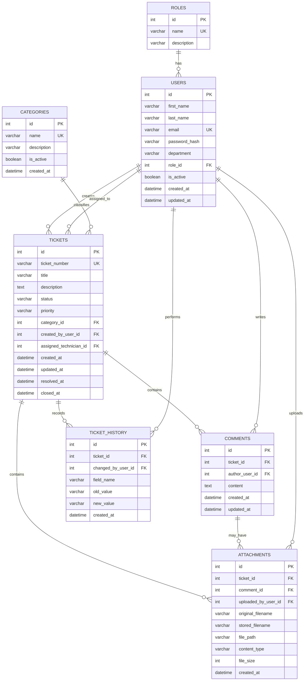

# ITOnIT Database Design

## 1. Document Introduction

**Document title:** ITOnIT Database Design
**Project name:** ITOnIT

ITOnIT is an internal IT support ticket management system. The database described in this
document supports the core workflow of the system: employees submitting support tickets,
technicians and managers handling those tickets, and the organization tracking the full
lifecycle of every request from submission to resolution.

This schema is designed for **Microsoft SQL Server** and will later be implemented using
**SQLAlchemy** (as the ORM layer) and **Alembic** (for schema migrations). This document
describes the intended structure only.

Database tables will **not** be created manually in SQL Server Management Studio (SSMS).
All tables will be created and versioned later through Alembic migrations, based on
SQLAlchemy models derived from this design.

---

## 2. Main Entities

The database contains the following seven tables:

1. `roles`
2. `users`
3. `categories`
4. `tickets`
5. `comments`
6. `attachments`
7. `ticket_history`

Each entity is described in detail in the sections below, including its purpose and a full
column reference table.

---

## 3. Roles Table

**Table name:** `roles`

**Purpose:** Defines the set of permission levels available in the system. Each user account
is assigned exactly one role, and each role may be shared by many users. Roles are stored in a
dedicated table rather than hard-coded so that role metadata (such as a description) can be
managed independently of user records.

| Column      | Data Type    | Required / Nullable | Primary Key | Foreign Key | Unique | Default | Description                                  |
|-------------|--------------|----------------------|-------------|-------------|--------|---------|-----------------------------------------------|
| id          | Integer      | Required             | Yes (PK)    | -           | Yes    | Auto-increment | Internal identifier for the role.       |
| name        | String(30)   | Required             | No          | -           | Yes    | -       | Role name (e.g. Employee, Technician).        |
| description | String(255)  | Nullable             | No          | -           | No     | -       | Optional description of the role's purpose.   |

**Initial records:**

- Employee
- Technician
- Manager
- Administrator

**Relationship:** Each user belongs to exactly one role, and one role may belong to many
users (one-to-many, `roles` → `users`).

---

## 4. Users Table

**Table name:** `users`

**Purpose:** Stores every person who interacts with the system — employees who submit
tickets, technicians who resolve them, managers who oversee the process, and administrators
who manage the system.

| Column        | Data Type   | Required / Nullable | Primary Key | Foreign Key        | Unique | Default | Description                                      |
|---------------|-------------|----------------------|-------------|---------------------|--------|---------|---------------------------------------------------|
| id            | Integer     | Required             | Yes (PK)    | -                   | Yes    | Auto-increment | Internal identifier for the user.          |
| first_name    | String(100) | Required             | No          | -                   | No     | -       | User's first name.                                 |
| last_name     | String(100) | Required             | No          | -                   | No     | -       | User's last name.                                  |
| email         | String(255) | Required             | No          | -                   | Yes    | -       | User's email address; used for login.              |
| password_hash | String(255) | Required             | No          | -                   | No     | -       | Securely hashed password.                          |
| department    | String(100) | Nullable             | No          | -                   | No     | -       | Department the user belongs to.                    |
| role_id       | Integer     | Required             | No          | roles.id            | No     | -       | Role assigned to the user.                         |
| is_active     | Boolean     | Required             | No          | -                   | No     | true    | Whether the user account is currently active.      |
| created_at    | DateTime    | Required             | No          | -                   | No     | -       | Timestamp when the user was created.               |
| updated_at    | DateTime    | Required             | No          | -                   | No     | -       | Timestamp when the user was last updated.          |

**Important notes:**

- Plain-text passwords must never be stored. Only a secure password hash is stored in
  `password_hash`.
- A user can create many tickets.
- A technician user can be assigned many tickets.
- A user can write many comments.
- A user can upload many attachments.
- A user can perform many ticket-history changes.

---

## 5. Categories Table

**Table name:** `categories`

**Purpose:** Classifies tickets by the type of issue being reported (for example, hardware
or network problems), which helps route tickets to the appropriate technicians and supports
reporting.

| Column      | Data Type   | Required / Nullable | Primary Key | Foreign Key | Unique | Default | Description                                    |
|-------------|-------------|----------------------|-------------|-------------|--------|---------|-------------------------------------------------|
| id          | Integer     | Required             | Yes (PK)    | -           | Yes    | Auto-increment | Internal identifier for the category.    |
| name        | String(100) | Required             | No          | -           | Yes    | -       | Category name (e.g. Hardware, Software).         |
| description | String(255) | Nullable             | No          | -           | No     | -       | Optional description of the category.            |
| is_active   | Boolean     | Required             | No          | -           | No     | true    | Whether the category is currently in use.        |
| created_at  | DateTime    | Required             | No          | -           | No     | -       | Timestamp when the category was created.         |

**Initial records:**

- Hardware
- Software
- Network
- Printer
- Account and Access
- Other

**Relationship:** One category may classify many tickets (one-to-many, `categories` →
`tickets`).

---

## 6. Tickets Table

**Table name:** `tickets`

**Purpose:** The central entity of the system. Each row represents a single IT support
request submitted by an employee, tracked through its full lifecycle until it is resolved
and closed.

| Column                  | Data Type   | Required / Nullable | Primary Key | Foreign Key   | Unique | Default | Description                                                       |
|--------------------------|-------------|----------------------|-------------|----------------|--------|---------|---------------------------------------------------------------------|
| id                       | Integer     | Required             | Yes (PK)    | -              | Yes    | Auto-increment | Internal database identifier for the ticket.               |
| ticket_number            | String(30)  | Required             | No          | -              | Yes    | -       | Public, human-readable ticket identifier (e.g. `IT-2026-000001`).   |
| title                    | String(200) | Required             | No          | -              | No     | -       | Short summary of the issue.                                         |
| description              | Text        | Required             | No          | -              | No     | -       | Full description of the issue.                                      |
| status                   | String(30)  | Required             | No          | -              | No     | -       | Current status of the ticket (see allowed values below).            |
| priority                 | String(20)  | Required             | No          | -              | No     | -       | Priority level of the ticket (see allowed values below).            |
| category_id              | Integer     | Required             | No          | categories.id  | No     | -       | Category the ticket belongs to.                                     |
| created_by_user_id       | Integer     | Required             | No          | users.id       | No     | -       | User who created the ticket.                                        |
| assigned_technician_id   | Integer     | Nullable             | No          | users.id       | No     | -       | Technician currently assigned to the ticket, if any.                 |
| created_at               | DateTime    | Required             | No          | -              | No     | -       | Timestamp when the ticket was created.                              |
| updated_at               | DateTime    | Required             | No          | -              | No     | -       | Timestamp when the ticket was last updated.                         |
| resolved_at              | DateTime    | Nullable             | No          | -              | No     | -       | Timestamp when the ticket was resolved.                             |
| closed_at                | DateTime    | Nullable             | No          | -              | No     | -       | Timestamp when the ticket was closed.                               |

**Allowed status values:**

- `NEW`
- `ASSIGNED`
- `IN_PROGRESS`
- `WAITING_FOR_EMPLOYEE`
- `RESOLVED`
- `CLOSED`

**Allowed priority values:**

- `LOW`
- `MEDIUM`
- `HIGH`
- `CRITICAL`

**Important rules:**

- `assigned_technician_id` is nullable because a new ticket may not yet be assigned to a
  technician.
- `ticket_number` is the public, human-readable identifier shown to users.
- `id` is the internal database identifier, used for relationships and lookups.
- Example ticket number format: `IT-2026-000001`.
- One ticket belongs to one category.
- One ticket is created by one user.
- One ticket may be assigned to one technician.
- One ticket may contain many comments.
- One ticket may contain many attachments.
- One ticket may contain many history records.

---

## 7. Comments Table

**Table name:** `comments`

**Purpose:** Stores the communication thread associated with a ticket — messages exchanged
between employees, technicians, and managers while a ticket is being worked on.

| Column         | Data Type | Required / Nullable | Primary Key | Foreign Key | Unique | Default | Description                                       |
|----------------|-----------|-----------------------|-------------|--------------|--------|---------|------------------------------------------------------|
| id             | Integer   | Required              | Yes (PK)    | -            | Yes    | Auto-increment | Internal identifier for the comment.        |
| ticket_id      | Integer   | Required              | No          | tickets.id   | No     | -       | Ticket the comment belongs to.                      |
| author_user_id | Integer   | Required              | No          | users.id     | No     | -       | User who wrote the comment.                         |
| content        | Text      | Required              | No          | -            | No     | -       | The comment text.                                    |
| created_at     | DateTime  | Required              | No          | -            | No     | -       | Timestamp when the comment was created.             |
| updated_at     | DateTime  | Nullable              | No          | -            | No     | -       | Timestamp when the comment was last edited, if ever. |

Comments store the ongoing communication between employees, technicians, and managers inside
a ticket, providing a complete conversation history alongside the ticket's status changes.

---

## 8. Attachments Table

**Table name:** `attachments`

**Purpose:** Stores metadata about files uploaded in connection with a ticket, such as
screenshots or photos supporting a reported issue.

| Column               | Data Type   | Required / Nullable | Primary Key | Foreign Key  | Unique | Default | Description                                                        |
|----------------------|-------------|-----------------------|-------------|---------------|--------|---------|-----------------------------------------------------------------------|
| id                   | Integer     | Required              | Yes (PK)    | -             | Yes    | Auto-increment | Internal identifier for the attachment.                    |
| ticket_id            | Integer     | Required              | No          | tickets.id    | No     | -       | Ticket the attachment belongs to.                                     |
| comment_id           | Integer     | Nullable              | No          | comments.id   | No     | -       | Comment the attachment is connected to, if any.                      |
| uploaded_by_user_id  | Integer     | Required              | No          | users.id      | No     | -       | User who uploaded the file.                                           |
| original_filename    | String(255) | Required              | No          | -             | No     | -       | Original name of the uploaded file.                                   |
| stored_filename      | String(255) | Required              | No          | -             | No     | -       | Name used to store the file on disk/storage.                          |
| file_path            | String(500) | Required              | No          | -             | No     | -       | Location of the stored file.                                          |
| content_type         | String(100) | Nullable              | No          | -             | No     | -       | MIME type of the file.                                                |
| file_size            | Integer     | Required              | No          | -             | No     | -       | Size of the file, in bytes.                                           |
| created_at           | DateTime    | Required              | No          | -             | No     | -       | Timestamp when the attachment was uploaded.                           |

**Important design rule:**

- The actual file content must not be stored directly inside SQL Server.
- SQL Server stores only file metadata and its storage location (`file_path`).
- An attachment can belong directly to a ticket.
- An attachment may also be connected to a specific comment.
- `comment_id` is nullable because attachments added during initial ticket creation are not
  connected to any comment.

---

## 9. Ticket_History Table

**Table name:** `ticket_history`

**Purpose:** Provides a structured, field-level audit trail of every change made to a
ticket, recording who made the change, what field changed, and the old and new values.

| Column             | Data Type   | Required / Nullable | Primary Key | Foreign Key | Unique | Default | Description                                          |
|---------------------|-------------|-----------------------|-------------|--------------|--------|---------|---------------------------------------------------------|
| id                  | Integer     | Required              | Yes (PK)    | -            | Yes    | Auto-increment | Internal identifier for the history record.   |
| ticket_id           | Integer     | Required              | No          | tickets.id   | No     | -       | Ticket the history record belongs to.                   |
| changed_by_user_id  | Integer     | Required              | No          | users.id     | No     | -       | User who made the change.                                |
| field_name          | String(50)  | Required              | No          | -            | No     | -       | Name of the field that changed.                          |
| old_value           | String(255) | Nullable              | No          | -            | No     | -       | Previous value of the field.                              |
| new_value           | String(255) | Nullable              | No          | -            | No     | -       | New value of the field.                                   |
| created_at          | DateTime    | Required              | No          | -            | No     | -       | Timestamp when the change occurred.                       |

This table creates a structured audit trail of all changes made to a ticket over its
lifecycle.

**Examples:**

| field_name             | old_value | new_value   |
|-------------------------|-----------|-------------|
| status                  | ASSIGNED  | IN_PROGRESS |
| priority                | MEDIUM    | HIGH        |
| assigned_technician_id  | null      | 8           |

**Why a structured history table is better than a generic text description:**

A structured table with `field_name`, `old_value`, and `new_value` columns allows the system
to filter, query, and report on specific types of changes (e.g. "show all priority escalations"
or "show all reassignments"), build accurate timelines, and support analytics such as average
time-to-resolution per status. A single free-text description field would require error-prone
text parsing to extract this information and could not be reliably queried, filtered, or
aggregated.

---

## 10. Relationships

- **Role** 1-to-many **Users**
- **User** 1-to-many **Tickets created**
- **User** 1-to-many **Tickets assigned as technician**
- **Category** 1-to-many **Tickets**
- **Ticket** 1-to-many **Comments**
- **User** 1-to-many **Comments**
- **Ticket** 1-to-many **Attachments**
- **Comment** 1-to-zero-or-many **Attachments**
- **User** 1-to-many **Attachments**
- **Ticket** 1-to-many **TicketHistory records**
- **User** 1-to-many **TicketHistory records**

---

## 11. Complete Mermaid ERD

---

## 12. Design Decisions

- **Roles and categories use separate tables** because they are shared by many records
  (users and tickets, respectively) and may later be managed by administrators through an
  admin interface, without requiring code changes.
- **Ticket status and priority use controlled application-level values** rather than free
  text, ensuring consistency across the system.
- **SQL Server does not have a native enum type**, so SQLAlchemy and database-level
  constraints will be used to enforce valid `status` and `priority` values once the models
  are implemented.
- **Separate status and priority lookup tables are not necessary for the first version** —
  the set of allowed values is small, stable, and defined at the application level, which
  keeps the schema simpler for this stage of the project.
- **Files will be stored outside SQL Server.** The `attachments` table stores only file
  metadata and a storage location; actual file content is kept in external/file storage.
- **The database schema will later be managed with Alembic migrations**, ensuring schema
  changes are versioned, repeatable, and reviewable.
- **No tables should be manually created in SSMS.** All schema changes must go through
  Alembic migrations to keep the database schema in sync with the application's models.

---

## 13. Non-Functional Database Rules

- Use **foreign keys** to preserve referential integrity between related tables.
- Use **unique constraints** for user emails, role names, category names, and ticket numbers.
- Use **UTC timestamps** wherever possible, to avoid time zone ambiguity.
- Use **indexes** later for commonly searched or filtered columns, including:
  - `ticket_number`
  - `email`
  - `status`
  - `priority`
  - `assigned_technician_id`
  - `created_at`
- **Avoid hard deletion** for users and categories; use the `is_active` flag instead, so
  historical references remain valid.
- **Closed tickets should remain stored** for audit and reporting purposes, rather than
  being deleted.
